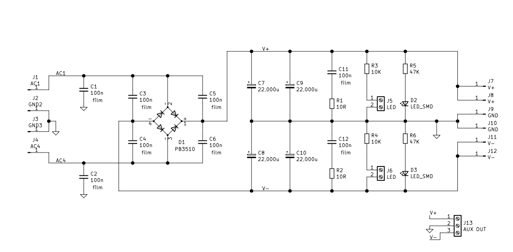

# Linear PSU board

Resources used to design this board:

* TI application note AN-1849 "An Audio Amplifier Power Supply Design (Rev. C)", 2019 - [link](https://www.ti.com/lit/pdf/snaa057)
* Manufacturers Report - "The Importance of the Power Supply", Nelson Pass, 1997 - [link](https://hometheaterhifi.com/volume_4_2/nelpass.html)
* "Linear Power Supply Design", Rod Elliott, 2001 - [link](https://sound-au.com/power-supplies.htm)
* "Power Supply Design", Tom Christinsen - [link](https://neurochrome.com/pages/power-supply-design)

